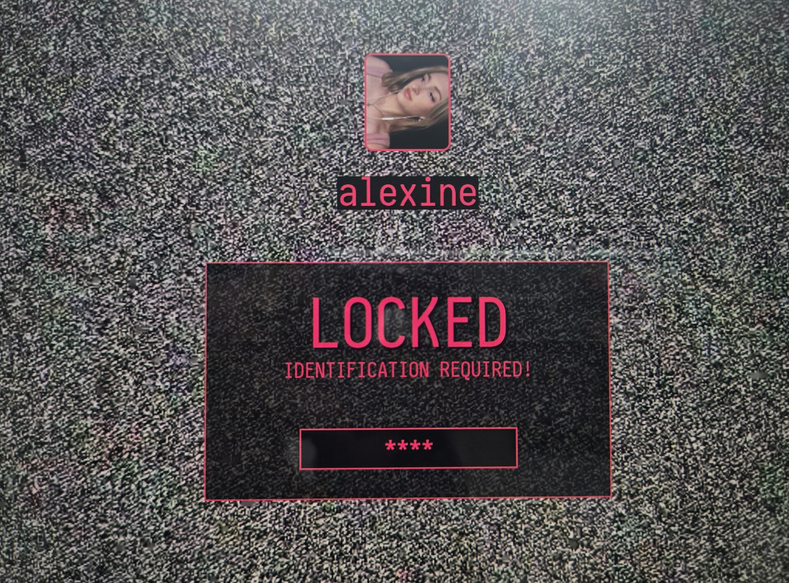

# Lexi Hyprlock

This README was updated by an LLM friend.

A customized Hyprlock theme for Hyprland, built around a black-and-white static
background, hard magenta accents, and a simple terminal-like authentication
panel.



## What Changed

- Reworked the lockscreen into a darker black and pink setup.
- Added a static/glitch background with high contrast.
- Added a centered avatar with a magenta border.
- Added layered shadow text for the username and `LOCKED` title.
- Added a framed authentication panel.
- Styled the password field with square corners, pink borders, and `*` dots.
- Replaced the personal username with `YOURNAME` for sharing.
- Replaced the personal avatar with a public placeholder avatar.
- Added a small install script that backs up the existing Hyprlock config.

## Visual Style

- Black and white TV-static background.
- Pink/magenta accent color, mostly `#e93f77`.
- Black transparent blocks and panels.
- Sharp rectangular authentication field.
- Thin magenta borders.
- Iosevka Nerd Font typography.
- Layout tuned for a Hyprland laptop setup.

## Included Files

- `hyprlock.conf`
- `install.sh`
- `assets/background.jpg`
- `assets/avatar.png`
- `screenshots/preview.jpg`

## Installation

Install Hyprlock:

```bash
https://wiki.hyprland.org/Hypr-Ecosystem/hyprlock/
```

Clone this repo:

```bash
git clone https://github.com/YOUR_USERNAME/lexi-hyprlock.git
cd lexi-hyprlock
```

Run the installer:

```bash
chmod +x install.sh
./install.sh
```

The installer copies the theme to:

```text
~/.config/hypr/lexi-hyprlock
```

It also backs up your current Hyprlock config before replacing:

```text
~/.config/hypr/hyprlock.conf
```

## Customization

- Change `YOURNAME` in `hyprlock.conf` to your own display name.
- Replace `assets/avatar.png` with your own avatar.
- Replace `assets/background.jpg` with another background.
- Change the accent color `e93f77` if you want another palette.
- If you copy `hyprlock.conf` manually instead of using `install.sh`, replace
  `__HOME__` with your home directory path.

## Test

```bash
hyprlock
```

## Notes

- The theme expects Iosevka Nerd Font to be installed.
- The layout is tuned for the author's Hyprland laptop setup, so geometry may
  need adjustment on another monitor.
- The public version does not include the author's personal avatar.
